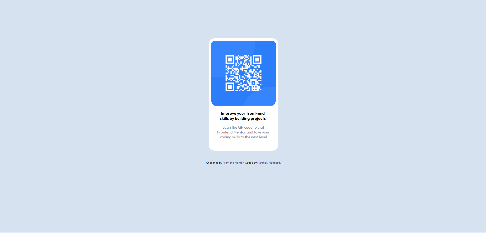

# Frontend Mentor - QR code component solution

This is a solution to the [QR code component challenge on Frontend Mentor](https://www.frontendmentor.io/challenges/qr-code-component-iux_sIO_H). Frontend Mentor challenges help you improve your coding skills by building realistic projects. 

## Table of contents

- [Overview](#overview)
  - [Screenshot](#screenshot)
  - [Links](#links)
- [My process](#my-process)
  - [Built with](#built-with)
  - [What I learned](#what-i-learned)
  - [Continued development](#continued-development)
- [Author](#author)

**Note: Delete this note and update the table of contents based on what sections you keep.**

## Overview

### Screenshot

Here is a screenshot of my solution.

### Links

- Solution URL: [Add solution URL here](https://your-solution-url.com)
- Live Site URL: [Add live site URL here](https://your-live-site-url.com)

## My process

### Built with

- HTML5 
- CSS

### What I learned

By working on this project, I solidified my knowledge of HTML and CSS, especially in terms of structuring content and styling it to achieve the desired look and feel. Throughout the project, I gained insights into the development process, from planning and designing to coding and testing. This helped me improve my workflow and efficiency.

### Continued development

I intend to continue practicing with CSS and HTML to further improve my abilities. I also intend to launch this as a website use Amazon's AWS to continue to gain knowledge of the development process from start to finish. 

## Author

- Website - [Add your name here](https://www.your-site.com)
- Frontend Mentor - [@mhaggard25](https://www.frontendmentor.io/profile/yourusername)
